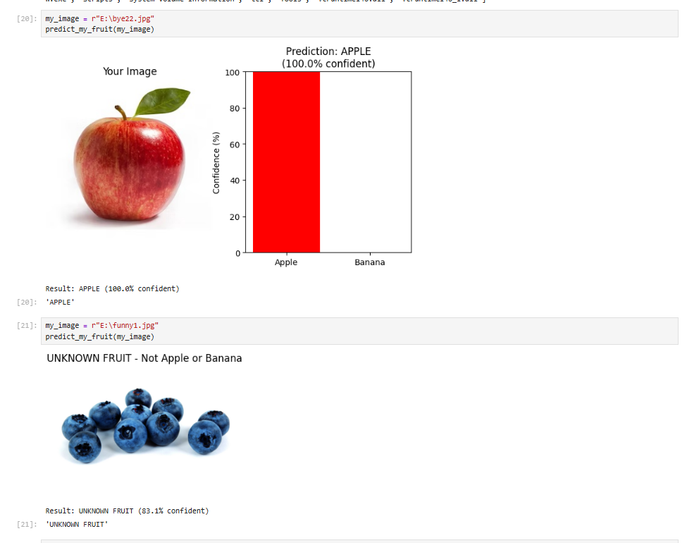
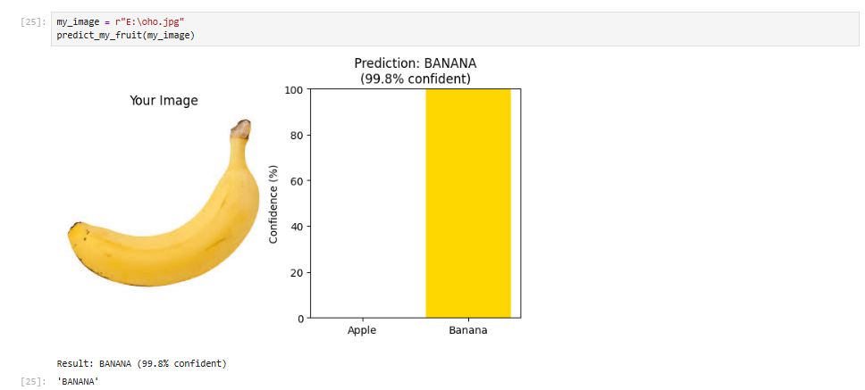

# Fruit Binary Classification

## Overview
A binary image classifier that detects whether an image contains an Apple or Banana using CNN (Convolutional Neural Network).

## Technologies Used
- Python
- TensorFlow / Keras
- OpenCV
- NumPy
- Matplotlib
- Jupyter Notebook

## Dataset
Kaggle: Fruit and Vegetable Image Recognition

## Model
- CNN with 3 Conv2D layers
- MaxPooling and Dropout layers
- Binary classification (Apple vs Banana)
- Validation Accuracy: 89.6%

## Results
- Apple detection: 100% confident
- Banana detection: 99.8% confident
- Unknown fruit detection included

- ## Results Screenshots
### Apple Detection

### Banana Detection

